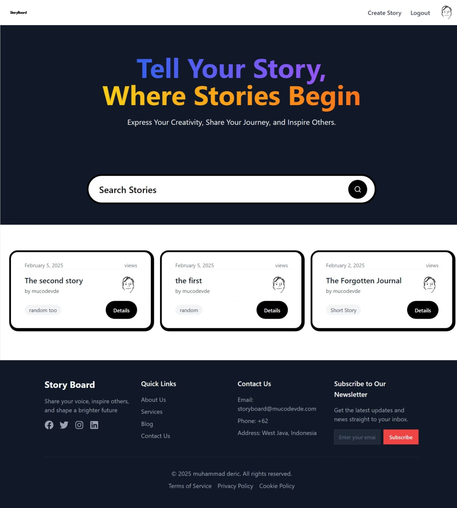

# Story Board App

## Overview

The **Story Board** is a web application designed to allow users to share and explore engaging stories. This platform enables users to create, post, and read stories across various categories, fostering a community of storytellers. With an intuitive interface, users can easily share their experiences, discover new perspectives, and connect through the power of storytelling.

## Screenshots

<div style="display: flex; justify-content: space-between;">
    
</div>

## Features

- 📝 **Create New Story** – Users can write and publish their own stories.
- 🔐 **Login with GitHub** – Secure authentication using GitHub.
- 🛠 **Ongoing Features**:
  - ✏️ Update stories
  - 🗑 Delete stories
  - 📤 Share stories

## Installation

To get started with the **Story Board App**, follow these steps:

1. **Clone the repository:**

    ```bash
    git clone https://github.com/muhammadderic/story-board.git
    cd story-board
    ```

2. **Install dependencies:**

    ```bash
    npm install
    ```

3. **Run the development server:**

    ```bash
    npm run dev
    ```

    Visit [http://localhost:3000](http://localhost:3000) in your browser to see the app in action.

## Technologies Used

- ⚡ **Next.js** – React framework for server-side rendering and static site generation.
- 🎨 **Tailwind CSS** – Utility-first CSS framework for styling.
- 🔑 **Auth.js** – Authentication library for handling user login.
- 📦 **Sanity** – Headless CMS for managing content.
- 📝 **@uiw/react-md-editor** – A Markdown editor for React with live preview.
- 📜 **markdown-it** – A fast and flexible Markdown parser.
- 📜 **@types/markdown-it** – TypeScript definitions for markdown-it.

## Contact

If you have any questions or suggestions, feel free to reach out:

- **GitHub**: [muhammadderic](https://github.com/muhammadderic)
